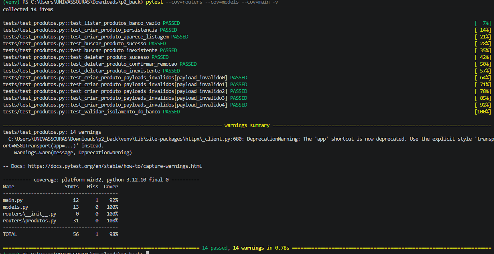

# API de Gerenciamento de Produtos - E-commerce

Esta é uma API RESTful desenvolvida com **FastAPI**, modelagem de dados via **SQLAlchemy (PostgreSQL)** e testada automatizadamente com **Pytest**.

**Diferenciais Implementados (Pensando Fora da Caixa):**
Embora os requisitos base fossem de um CRUD simples, a aplicação foi desenhada visando padrões rigorosos de mercado e resiliência:

- **Arquitetura Modular:** Separação limpa de responsabilidades em `models.py`, `schemas.py`, `database.py` e rotas em `routers/produtos.py`, facilitando a manutenibilidade.
- **Prevenção de Conflitos de Ambiente:** O banco de desenvolvimento foi alocado na porta 5434 para evitar colisões com instalações nativas do PostgreSQL no S.O. do desenvolvedor.
- **Paginação:** Implementada na listagem de produtos (`skip` e `limit`) para evitar sobrecarga no banco de dados em catálogos grandes.
- **Auditoria:** Campos `created_at` e `updated_at` geridos nativamente no banco de dados.
- **CORS Middleware:** Configurado para aceitar requisições de clientes web (frontends).
- **Health/Redirect Root:** A rota raiz (`/`) redireciona automaticamente para o Swagger (`/docs`), melhorando a Developer Experience (DX).

---

## 🚀 1. Como subir a Infraestrutura (Docker)

O projeto exige o uso de um banco de dados **PostgreSQL** real para testes, garantindo que `constraints` (como a trava de preço maior que zero) sejam testadas exatamente como ocorrerão em produção.

Para subir a infraestrutura do banco de testes isolado (sem volumes persistentes), execute:

```bash
docker-compose up -d db_test
```

*(Dica: Confirme se o container está saudável rodando `docker-compose ps` antes de avançar).*

Caso deseje subir o ambiente completo (incluindo o banco de desenvolvimento na porta 5434), utilize apenas `docker-compose up -d`.

---

## 🧪 2. Como Executar os Testes

Com o container `db_test` rodando com status *(healthy)*, ative seu ambiente virtual e execute a suíte de testes na raiz do projeto. O comando abaixo já inclui a validação de cobertura (coverage):

```bash
pytest --cov=routers --cov=models --cov=main -v
```

### Saída Esperada do Pytest
Abaixo está a comprovação da execução da suíte, que contempla **14 funções de teste** (superando o mínimo exigido) e atinge **98% de cobertura** de código:



---

## 🛡️ 3. Como funciona o Isolamento entre Testes

Para garantir que um teste não interfira no outro (evitando "sujeira" no banco, falsos positivos ou falhas por ordem de execução), o projeto utiliza a seguinte estratégia estrita no arquivo `conftest.py`:

1. **Sessão Exclusiva (Teste Real):** Uma `engine` do SQLAlchemy é conectada estritamente à porta do banco de testes provido pelo Docker (`5433`). O `pytest.ini` também assegura que a variável `DATABASE_URL` aponte para este banco durante os testes.
2. **Fixture `db_session` (Setup & Teardown):** Aplicamos o padrão de `yield` do Pytest. Antes de **cada** teste ser executado, a instrução `Base.metadata.create_all` recria a estrutura de tabelas do zero. Após o `yield` (fim da execução do teste isolado), a instrução `Base.metadata.drop_all` destrói completamente as tabelas.
3. **Dependency Override:** A fixture `client` intercepta a injeção de dependência `get_db` da API (FastAPI) usando o `app.dependency_overrides`. Ela substitui a conexão do banco de produção pela nossa `db_session` isolada. Dessa forma, as rotas da API passam a interagir de forma invisível e segura com o banco descartável a cada nova requisição do *TestClient*.
